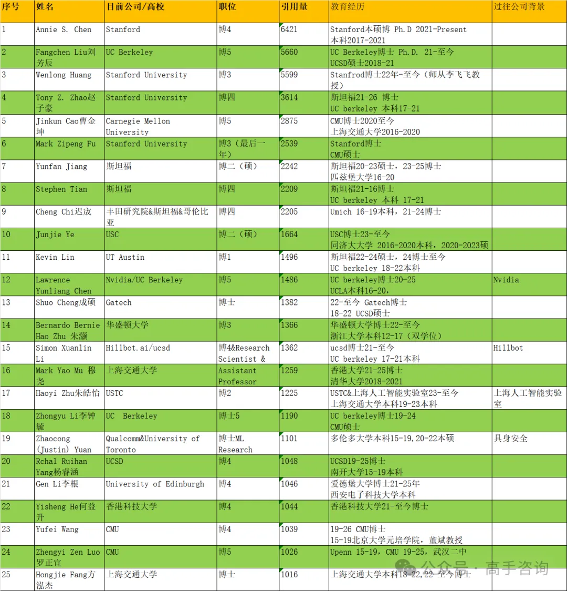

# -
具身智能领域华人学术引用量排行榜

2024年具身智能无疑是最火爆的领域，我们作为高管招聘的从业者，必须要了解市面上顶尖的人才在哪里，而谷歌学术史非常便捷的统计方式，于是有了这篇文章的诞生。

一、	前言

二、	总表和分表（行业名人、学术过万、年轻博士、在读博士）

三、	高引paper

四、	适合像我这样外行人看的paper

五、	优秀机器人LAB

六、	统计过程看到一个有趣的事情

七、	表格的梳理逻辑

前言

在统计的时候，首先就要回答一个问题具身智能的定义是什么？因为在了解这个行业的时候发现具身智能领域概念非常杂，且没有统一标准，各种描述也非常交叉，甚至会出现大家都在说我在做控制的时候，其实两个人研究领域是天差地别的情况。

业内常见有两种分类标准

1.大脑）、小脑、本体，这种分法在产业界使用较多；

2.感知、自主规划、决策、行动、执行，一般在学术界居多；

我统计的主要涉及：人形机器人，特点是通过视觉感知物理世界（视觉算法），数据上传到大脑进行认知理解（具身大模型算法），做出任务规划（规划控制），通过上肢机械臂和手完成抓取动作（机械臂、灵巧手）以及下肢腿部（轮式、双足、四足等）行走、跳跃、翻身等动作（运动、力学控制）；

而从软硬件的角度来看，软件更为稀缺，以具身大模型算法为代表，这可能也是LLM大语言模型火了之后为什么会带动机器人这么火的原因，因为大家仿佛看到了让机器人变的智能这条路多多少少有点达成的可能性，但是即使如此，具身大模型业内也有非常多的方向，比如强化学习、模仿学习、深度学习、端到端、遥操作等。

特殊说明：

1.传统机器人比如微型机器人（如医疗机器人）、外骨骼机器人（如上肢、下肢等）、扫地机器人、飞行机器人（无人机），以及涉及硬件如传感器、传统控制等不在表格范围内；

2.效仿下《麻省理工科技评论》35位35岁以下的科技精英，表格统计40岁以下科研大佬，无法和每一位大佬确认年龄，一般按照19岁上大学的逻辑来推算，比如1985年人，2004年开始大学生涯；

3.引用量截止在1000以上，为什么是1K+？具身智能毕竟还是一个非常新的概念，虽然1K在经典的NLP CV领域不算太多，但参考几个知名大佬比如最近刚刚从腾讯加入优必选的郑宇，是腾讯X Robot Lab控制中心负责人，属于很资深的人了，但学术引用量是1842； 

4.学术引用量的数字截止时间为3月12号，因为统计进度，具体数字会有些许误差；
	
二、 总表明细和分表、

按照上述的标准下，总计178个人，做了简单的标签区分，便于大家查阅

行业名人

学术过万（20人）

年轻博士（29人）：博士毕业3年以内的（即22年、23年、23年毕业的同学）

在读博士（25人）：博士还未毕业的同学

学术总表明细（共计178人）

目前在美国99人，占比总人数的55.6%，要知道我统计的只是华人，起码在具身领域，中美的差异巨大。

三、 高引paper

四、 适合外行人看的paper

一般专业术语是文献综述literature review：

五、 优秀机器人LAB

Google谷歌机器人研究团队：https://research.google/research-areas/robotics/

Nvidia英伟达 机器人研究团队：https://research.nvidia.com/research-area/robotics

CMU：https://www.nrec.ri.cmu.edu/

Stanford：https://real.stanford.edu/lab.html

MIT：https://drc.csail.mit.edu/team/

六、 有趣的事情

表格里大部分都是清北复交顶尖名校的天才，但个人认为有一部分非常值得单拉出来说说，这些人大多数是本科普通，但通过个人努力硕博期间完成非常不错的跨级晋升，而且这样的还非常多，比如

上海交通大学的卢策吾老师---重庆邮电大学本科-中国科学院硕士-CUHK博士-Stanford博后；

UCSD的Xiaolong Wang王小龙老师---华南农业大学本科-中山大学硕士-CMU博士；

北京大学的仉尚航老师---东南大学本科-北京大学硕士，CMU博士；

字节的孔涛老师---山东大学本科-清华大学博士；

YrobotCEO Ye Ding 丁也老师---东南大学本科-美国东北大学硕士-哈佛大学博士；

其中跨越最大的是Tacta Systems 技术总监苏哲老师---沈阳工业大学本科-南加州大硕博士，后面还在顶尖的机器人公司工作过，Figure/Dexterity；

七、 表格的梳理逻辑

通过一个人的谷歌学术，如苏昊老师，学术主页上会有各种标签，Embodied AI，CV， CG， ML

点击：Embodied AI，就会出现相关研究人员。

挨个点开，依次筛选，合适的就放在表格，但只看这一个标签，容易遗漏，因此在看其他人的时候，会发现有其他标签的也属于具身智能领域，继续循环上面操作，整个表格大概统计了如下几个标签：

Robotics，Robot Learning，Motion Planning，Manipulation，Human-robot interaction，Tactile sensing，Robotic Grasping，Foundation Models，dexterous manipulation，SLAM，Autonomous Driving等；

这里面最不相关的其实是Autonomous Driving，里面虽然非常多人的标签里面包含Robotics，但自动驾驶的AI和我上述的定义差异太大，在看过很多学术主页之后，到后期我看到这个标签之后基本就直接略过，不过也确实少数除外，比如Pinxin Long，虽然属于百度自动驾驶，但是主页有明显涉及机器人抓取，分拣的研究；

其中最相关的是Robot Learning和Robotics，最难的是Robotics，因为好像只要是做AI的都会有这个标签，而如果只有这一个标签，往往还很合适，我最终翻到了第5011- 5020页，按照一页20个列表来计算，大概翻到251页，终于到学术引用量1K附近。

最后：个人毕竟外行，疏漏之处在所难免，非常希望行业同学提出批评意见！

原文链接：https://mp.weixin.qq.com/s/_TXjlq-I-1gnkfo2l0a5tg
